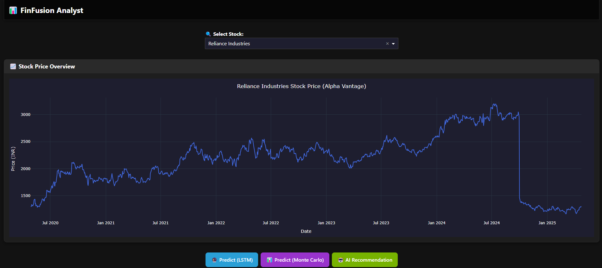
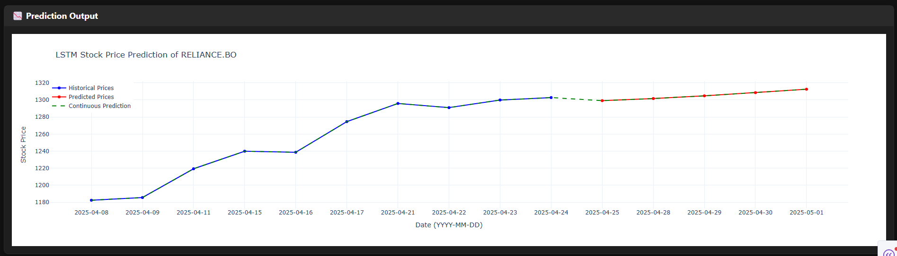
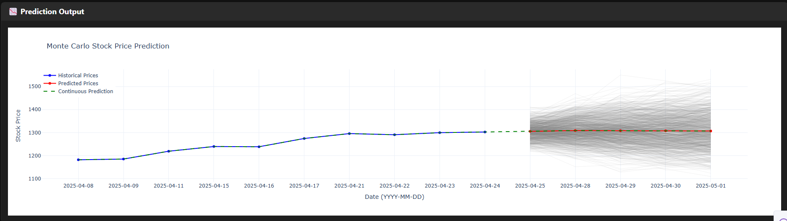
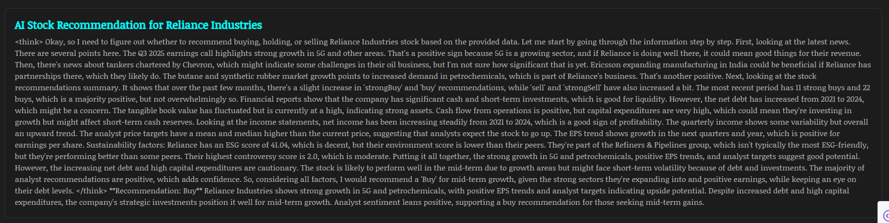

# FinFusion Analyst

**FinFusion Analyst** is an AI-driven financial analysis platform designed to simplify stock price prediction and investment recommendations for Bombay Stock Exchange companies (BSE India).
It combines deep learning models, Monte Carlo simulations, and AI-based insights into a user-friendly dashboard.






## Features

- 📈 **Stock Price Visualization**: View historical stock prices in an interactive chart.
- 🤖 **Predict Stock Prices**: Predict future stock prices using:
  - LSTM (Long Short-Term Memory) model
  - Monte Carlo Simulation
- 🧠 **AI Recommendation**: Get AI-generated investment suggestions based on market analysis.
- 🎨 **Modern Dark Theme**: Clean, dark-themed UI for a better user experience.

## Tech Stack

- **Dash** by Plotly
- **TensorFlow / Keras** (for LSTM model)
- **Monte Carlo Simulations** (with Geometric Brownian Motion)
- **Alpha Vantage API** (for real-time stock data)
- **Custom CSS Styling** (for modern dark theme)

## Project Status

🚧 **This project is still under development.**  
More features, improvements, and models are being added actively.

## Setup Instructions

1. Clone the repository:
   ```bash
   git clone https://github.com/your-username/finfusion-analyst.git
